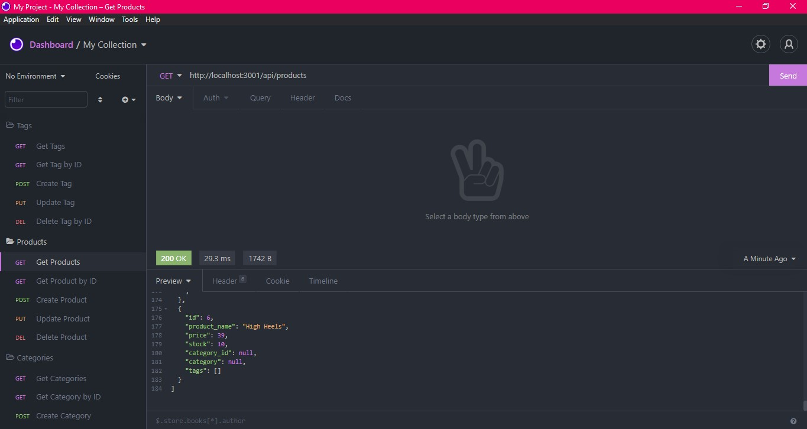

# E-commerce Back End 



## Installation
Clone repository from Github. Install all neccessary modules using `npm install`. To setup database, run `mysql -u root -p` and enter your password. To run schema, type `source db/schema.sql` , then type `exit;` to exit the MySql prompt. Then seed the database by typing `npm run seed`. Lastly to start the server run `npm start`.

## Video Previews
Video displaying how to setup tables - Use Schema, then SEED and start server.\
https://watch.screencastify.com/v/bn9HJZF05uuN1SqU90ym   


Video displaying all routes through Insomnia.\  
https://watch.screencastify.com/v/o8r02i1WxhY7E1gRVyM7  


### User Story
```
AS A manager at an internet retail company
I WANT a back end for my e-commerce website that uses the latest technologies
SO THAT my company can compete with other e-commerce companies
```

### Acceptance Criteria 
```
GIVEN a functional Express.js API
WHEN I add my database name, MySQL username, and MySQL password to an environment variable file
THEN I am able to connect to a database using Sequelize
WHEN I enter schema and seed commands
THEN a development database is created and is seeded with test data
WHEN I enter the command to invoke the application
THEN my server is started and the Sequelize models are synced to the MySQL database
WHEN I open API GET routes in Insomnia Core for categories, products, or tags
THEN the data for each of these routes is displayed in a formatted JSON
WHEN I test API POST, PUT, and DELETE routes in Insomnia Core
THEN I am able to successfully create, update, and delete data in my database
```
